# Ejercicio 03 - Profundizando en Workflows y Eventos

Ahora para esta sección del curso he preparado otro proyecto de ejemplo, que en realidad está basado en el mismo proyecto de ejemplo anterior, pero que ya viene con un workflow, un archivo **eventos.yml** situado en la carpeta **.github>workflows** donde tenemos definido un workflow de demostración muy simple. Sin embargo, falta el evento porque eso es exactamente lo que revisaremos y en lo que nos sumergiremos en este módulo del taller.

<pre>
name: Ejercicio con Eventos
<span style="color:DarkRed;">on: ...</span>
jobs:
  deploy:
    runs-on: ubuntu-latest
    steps:
      - name: Mostrar datos del evento
        run: echo "${{ toJSON(github.event) }}"
      - name: Obtener código
        uses: actions/checkout@v4
      - name: Instalar dependencias
        run: npm ci
      - name: Ejecutar pruebas
        run: npm run test
      - name: Compilar código
        run: npm run build
      - name: Desplegar el proyecto
        run: echo "Desplegando..."
</pre>

A continuación tenemos 2 secciones claramente diferenciadas. La primera detallará los pasos que debemos seguir para preparar nuestro entorno para el desarrollo del ejercicio. Y la segunda parte detalla el desarrollo completo de los ejercicios, paso a paso.

## Preparación del ejercicio

1. Para empezar a trabajar en este ejercicio, debemos crear nuestra propia copia de este repositorio. Para esto, debemos crear un **fork** del repositorio haciendo click en el desplegable al lado de la opción de **Fork** y seleccionando la opción *Create a new fork*.
   
   	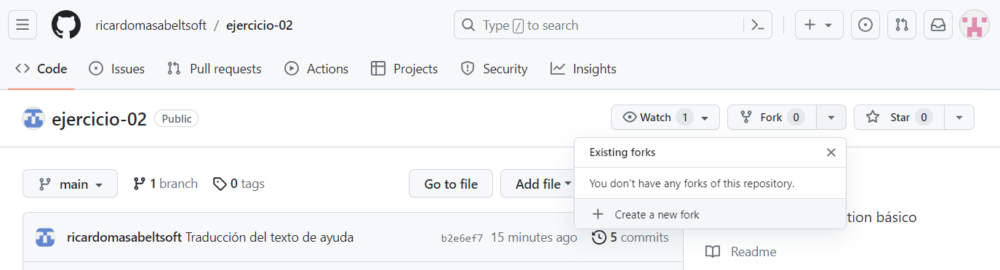

2. Luego, en los detalles del fork, seleccionamos nuestra cuenta personal en el desplegable de **Owner** y nos aseguramos que el nombre del repositorio está disponible y con el mensaje en verde, y hacemos clic en el botón verde **Create fork**.
   
   	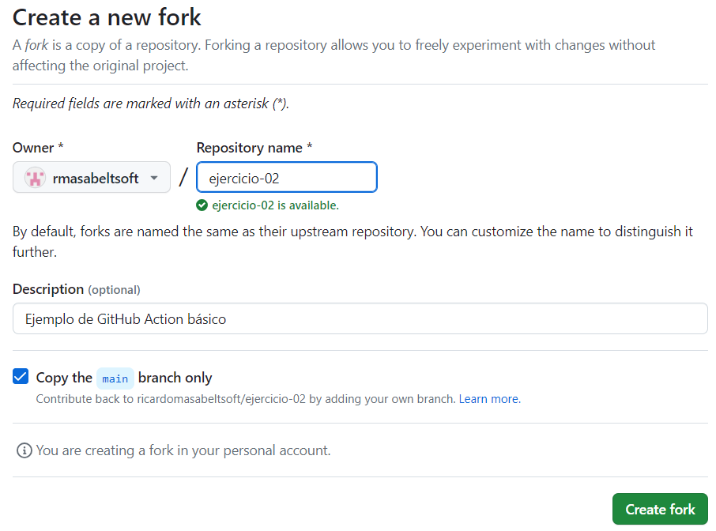

    En caso el nombre del repositorio no esté disponible, simplemente cambiamos el nombre por uno que sí lo esté. Esto no cambiará en nada el resultado o la lógica de nuestro desarrollo del ejercicio.

3.  Una vez cargue nuestro nuevo repositorio, hacemos clic en el botón verde **Code**, cambiamos a la pestaña Codespaces en el panel que se muestra y hacemos clic en el botón verde **Create codespace on main**.
   
   	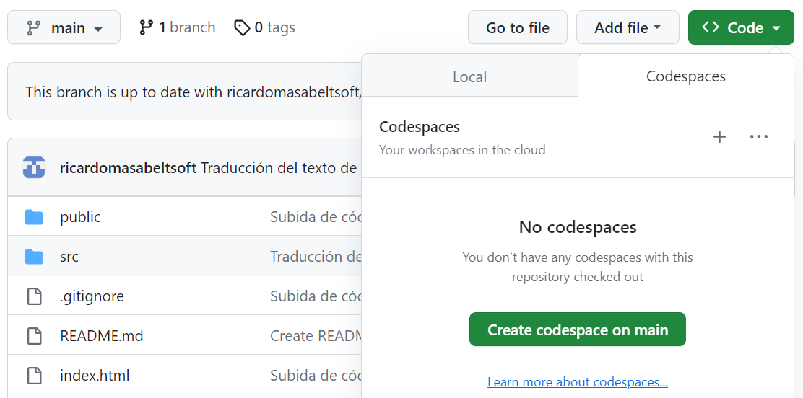

    En caso el bloqueador de pop-ups del browser interrumpa el lanzamiento del Codespace, otorgar los permisos necesarios y repetir el proceso.

4.  Se abrirá una nueva pestaña en nuestro browser con un entorno de desarrollo basado en Visual Studio Code, hospedado en la Nube de GitHub y con nuestro proyecto cargado y listo para trabajar.
   
   	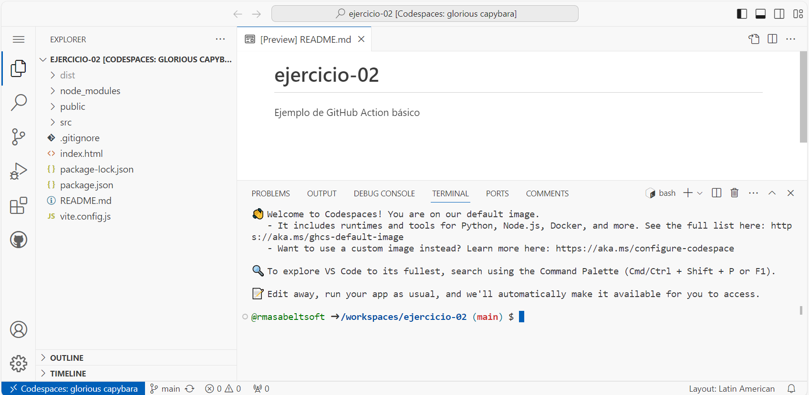

    Este entorno de desarrollo elimina nuestra necesidad de instalar localmente las herramientas y librerías necesarias para el desarrollo de nuestros ejercicios.

5. Este paso y el siguiente son meramente opcionales. En caso la presentación del entorno de desarrollo en su configuración por defecto no sea muy cómoda para ti, siempre puedes cambiar el tema de color haciendo clic en el botón de **Manage** (el engranaje en la esquina inferior izquierda), y seleccionar las opciones **Themes > Color Theme**.
   
   	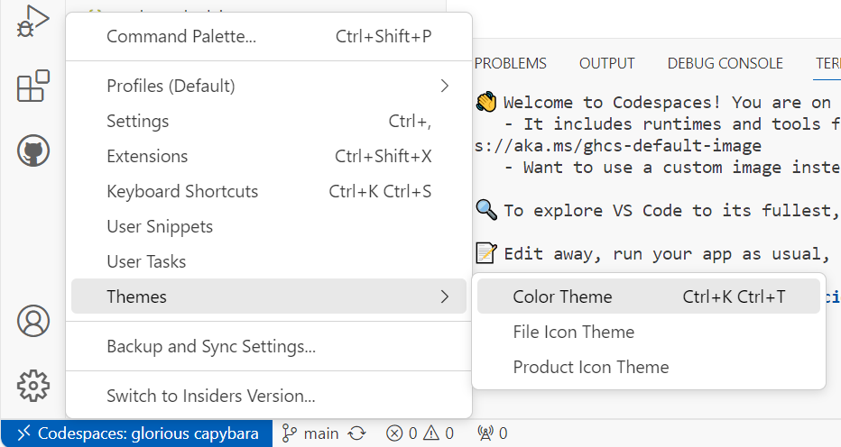

6. Se desplegarán las opciones de tema de color disponibles y, para elegir aquella con la que estemos más cómodos, simplemente debemos navegar las opciones con las flechas arriba y abajo de nuestro teclado y dar **Enter**.
   
   	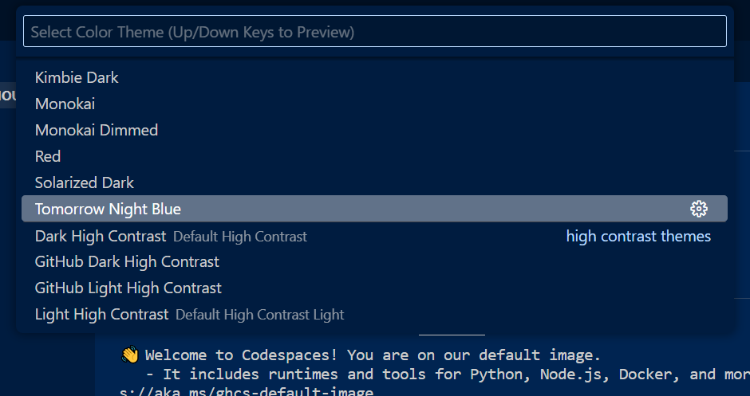

    El tema mostrado en esta imagen es sólo referencial.

7. Una vez cargada nuestra copia del repositorio del ejercicio en nuestro entorno de desarrollo, vemos que también se muestra el terminal listo para empezar a ejecutar los comandos que sean necesarios. En este caso, lo primero que vamos a hacer es probar lo que hace nuestra aplicación de ejemplo. Para esto, ingresamos el siguiente comando en nuestro terminal:
   
   ```
   npm install
   ```

    Esto nos debería devolver una salida similar a la siguiente:
   
   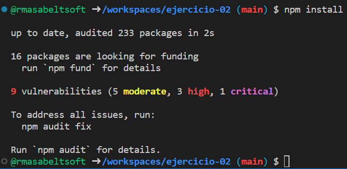

8. Luego, para lanzar nuestra aplicación en modo desarrollo, ingresamos este comando:

   ```
   npm run dev
   ```

   Esto nos debería devolver una salida similar a la siguiente, así como una notificación de que podemos acceder a nuestra aplicación haciendo clic en el botón **Open in Browser**, que es justo lo que vamos a hacer:
   
   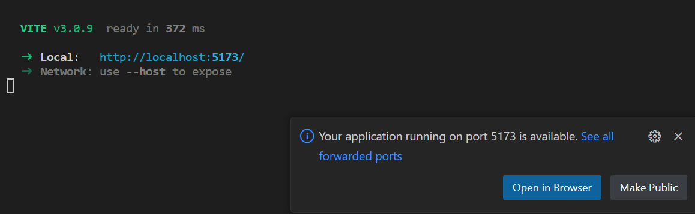

9. Esto lanza nuestra aplicación en una nueva pestaña de nuestro browser y podemos probar su simple funcionalidad.
   
   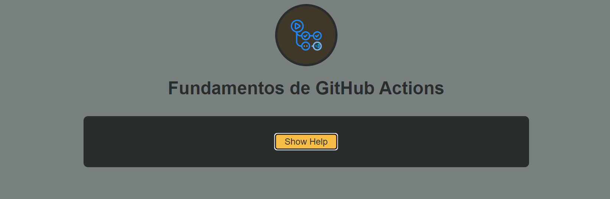
   
   Una vez probada nuestra aplicación, para detenerla, simplemente volvemos a nuestro entorno de desarrollo, hacemos clic en el terminal para asegurarnos que el foco se encuentra allí y digitamos `Ctrl+C`. Una vez realizado esto, el terminal volverá a estar listo para ingresar nuevos comandos.

10. FinalmenPor último, como todo el propósito de nuestro ejercicio consiste en practicar con las funcionalidades de GitHub Actions, es un buen momento para instalar la extensión de GitHub Actions. Para esto, seleccionamos la opción **Extensions** (aquella que parece una pieza de tetris) en la barra lateral izquierda, en el buscador de extensiones ingresamos el texto `GitHub Actions`, y le damos al botón **Install** a la derecha de la primera extensión mostrada en el listado (aquella que tiene a GitHub como autor verificado).
   
    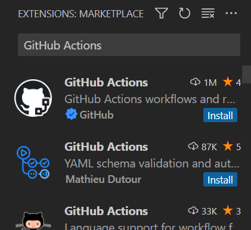

11. Una vez instalada la extensión de GitHub Actions, seleccionar su ícono en la barra lateral, y hacer clic en el botón **Sign in to GitHub**.
    
    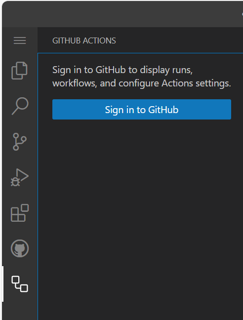
   
    Se mostrará un aviso y seleccionamos **Allow**.

    Si el browser nos pide las credenciales de GitHub, las ingresamos y se mostrará el mensaje **You can now close the window.**.

12. Luego de confirmar las credenciales, el panel de GitHub actions nos debe mostrar sus 3 secciones: Current Branch, Workflows y Settings.

    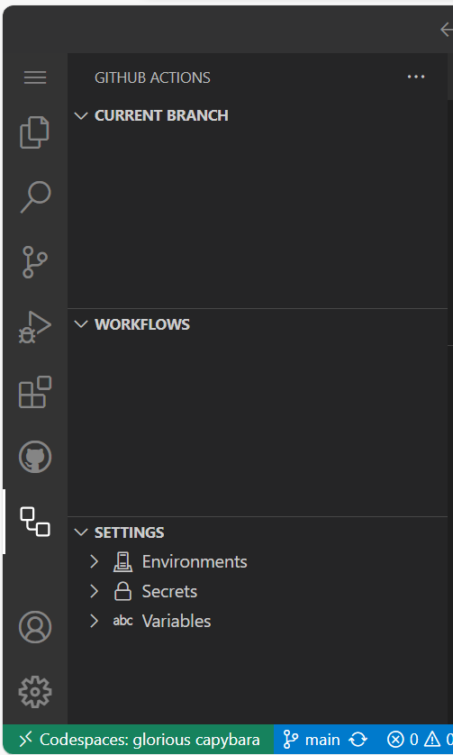

13. Abrimos nuestro archivo de definición de workflow **eventos.yml**, y agregamos los eventos `push` y `workflow_dispatch`, y guardarmos nuestro archivo.
    
    <pre>
    name: Ejercicio con Eventos
    <span style="color:Navy;"><b>on: [push, workflow_dispatch]</b></span>
    jobs:
      deploy:
        runs-on: ubuntu-latest
        steps:
          - name: Mostrar datos del evento
            run: echo "${{ toJSON(github.event) }}"
          - name: Obtener código
            uses: actions/checkout@v4
          - name: Instalar dependencias
            run: npm ci
          - name: Ejecutar pruebas
            run: npm run test
          - name: Compilar código
            run: npm run build
          - name: Desplegar el proyecto
            run: echo "Desplegando..."
    </pre>

14. En el terminal de nuestro entorno de desarrollo sincronizamos nuestros cambios ingresando los siguientes comandos:

    <pre>
    git add .
    git commit -m "Adición de eventos básicos"
    git push
    </pre>

15. Volvemos a la página de nuestro proyecto e ingresamos a la pestaña de **Actions**, donde se nos mostrará una advertencia indicando que los workflows están desactivados porque venían ya en el repo desde el que se hizo el fork.

    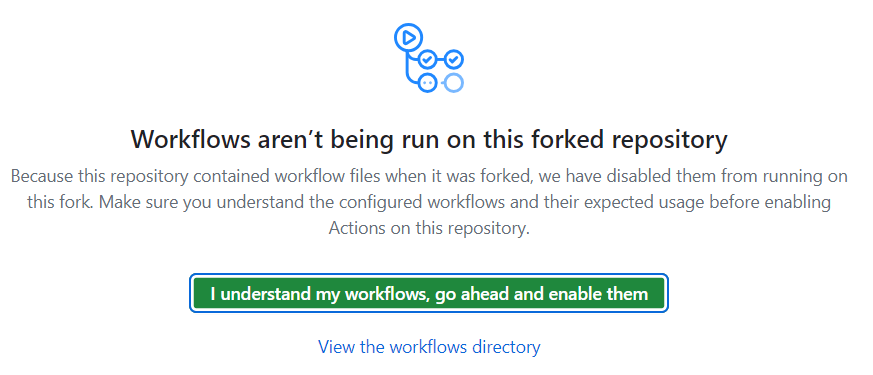

    Para activar nuestro workflow, simplemente le damos clic al botón verde **I understand my workflows, go ahead and enable them**.

16. Una vez activados los workflows nuevamente, seleccionamos en el panel de la izquierda nuestro workflow **Ejercicio con Eventos** y en el panel derecho le damos clic a **Run workflow**. Luego de unos segundos, obtendremos el resultado de dicha ejecución:

    

17. Luego, podremos ver nuestro workflow en el segundo panel de la extensión de GitHub Actions en nuestro entorno de desarrollo (probablemente sea necesario darle clic al botón **Refresh**).

    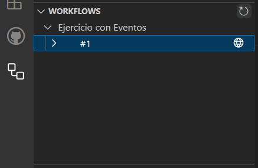

18. (Opcional) Si intentamos lanzar nuestro workflow con el botón **Trigger workflow**, la paleta de comandos nos solicitará confirmar la referencia para la ejecución de nuestro workflow. Aquí podemos confirmar el valor por defecto dándole simplemente a ***Enter***.

    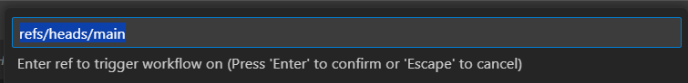

    Sin embargo, esta es una funcionalidad que por el momento todavía no está soportada en GitHub CodeSpaces, por lo que se nos mostrará el siguiente mensaje de error:

    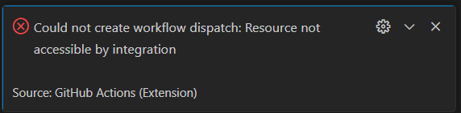

    A pesar de esto, la extensión no tiene problemas en mostrarnos el estado de los workflows gatillados de cualquier otra forma, tal como en el caso de nuestra primera ejecución manual. 

Por fin, con este paso tenemos nuestro entorno listo para proceder con el desarrollo del ejercicio a continuación.

## Desarrollo del ejercicio

1. Para iniciar el desarrollo del ejercicio, actualizamos nuestro documento de workflow reemplazando el contenido de la directiva **on**:
   
   	<pre>
    name: Ejercicio con Eventos
    <span style="color:Navy;"><b>on:
      pull_request:
        types:
          - opened
      workflow_dispatch:</b></span>
    jobs:
      deploy:
        runs-on: ubuntu-latest
        steps:
          - name: Mostrar datos del evento
            run: echo "${{ toJSON(github.event) }}"
          - name: Obtener código
            uses: actions/checkout@v4
          - name: Instalar dependencias
            run: npm ci
          - name: Ejecutar pruebas
            run: npm run test
          - name: Compilar código
            run: npm run build
          - name: Desplegar el proyecto
            run: echo "Desplegando..."</pre>
   
2. Sincronizamos nuestros cambios hacia el repositorio con los siguientes comandos:
   
   <pre>
   git add .
   git commit -m "Adición de tipos de actividades"
   git push</pre>

3. Verificamos en la pestaña **Actions** de nuestro repositorio y vemos que no hay más ejecuciones de nuestro workflow.
   
   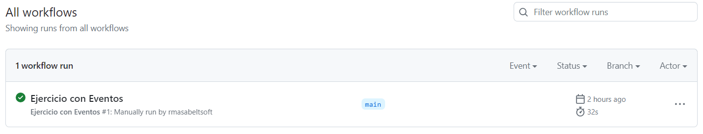

4. Agregamos una nueva rama denominada **dev**:
   
   <pre>
   git checkout -b dev</pre>

5. Hacemos un pequeño cambio en el encabezado en nuestro archivo **App.jsx**.

   ```
   import MainContent from './components/MainContent';
   import logo from './assets/images/logo.png';

   function App() {
     return (
       <>
         <header>
           <div id="logo-img">
             
           </div>
           <h1>Fundamentos de GitHub Actions y Eventos</h1>
         </header>
         <MainContent />
       </>
     );
   }

   export default App;
   ```
   
6. Sincronizamos nuestros cambios hacia una nueva rama en el repositorio con los siguientes comandos:
   
   <pre>
   git add .
   git commit -m "Cambio de encabezado"
   git push origin dev</pre>

7. Volvemos a nuestro repositorio y cambiamos a la pestaña **Code**. Se nos mostrará una notificación de push reciente a la rama dev, y hacemos clic en el botón verde **Compare & pull request**.
   
   

8. En la configuración del pull request nos aseguramos de seleccionar en ambos casos nuestro repositorio (no de aquel que hicimos fork). Y en la vista de comparación de cambios confirmamos la creación del pull request dando clic en el botón verde **Create pull request**.
   
   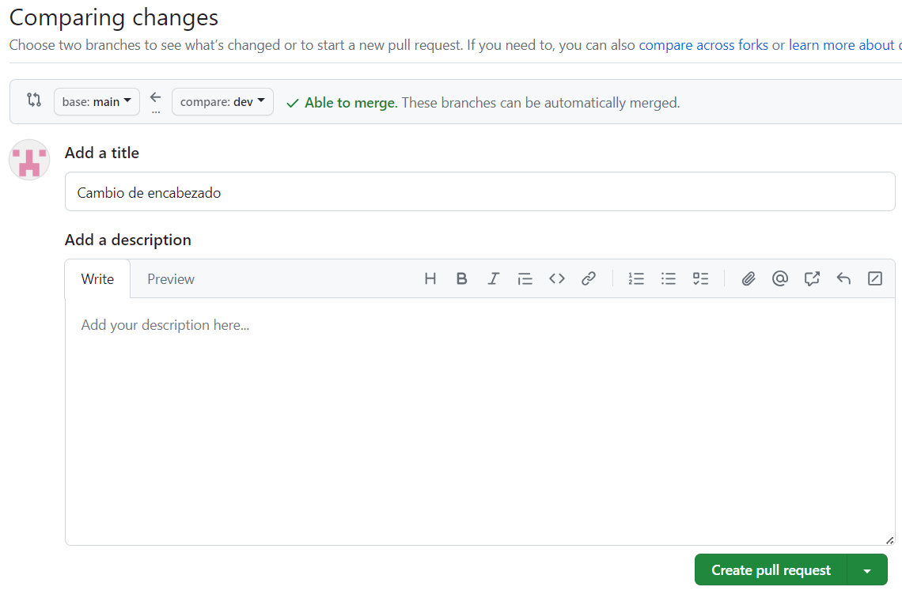

9. Cambiamos a la pestaña **Actions** y ahora sí vemos la nueva ejecución gatillada al crear el pull request.
   
   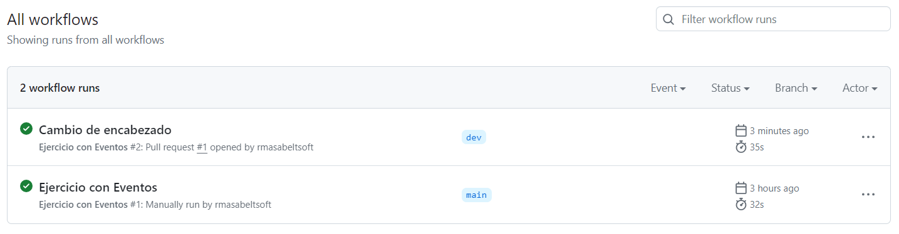

10. Igual, en nuestro entorno de desarrollo también podemos ver la nueva ejecución en el panel **Workflows** de la extensión de GitHub Actions.
   
    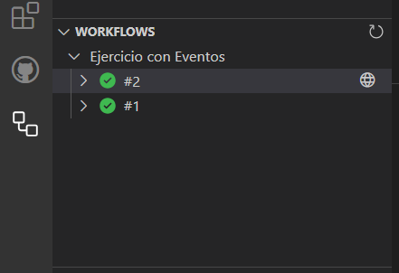

11. Volvemos a nuestro repositorio y cambiamos a la pestaña **Pull requests** y veremos que aparece listado nuestro reciente pull request, y hacemos clic en su nombre **Cambio de encabezado**.
   
    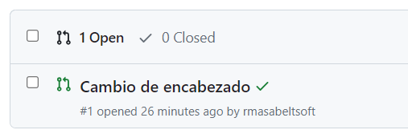

12. Para probar el evento de cierre del pull request y validar si se ejecuta o no nuestro workflow, vamos a hacer clic en el botón verde **Merge pull request**.
   
    

13. Paso seguido, hacemos clic en el botón verde **Confirm merge**.
   
    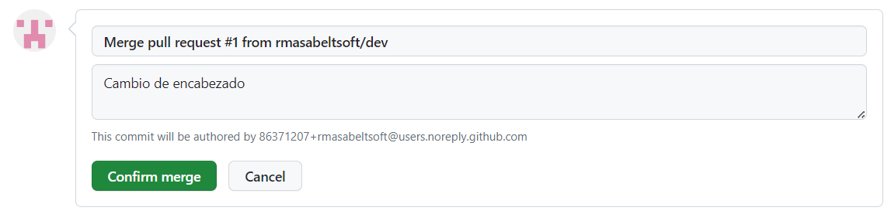

14. Se nos muestra la confirmación del pull request cerrado.
   
    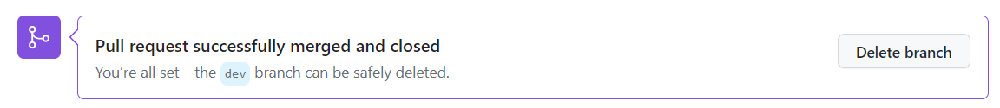

15. Volvemos a nuestra pestaña **Actions** y, efectivamente, no hay nuevas ejecuciones.
    
